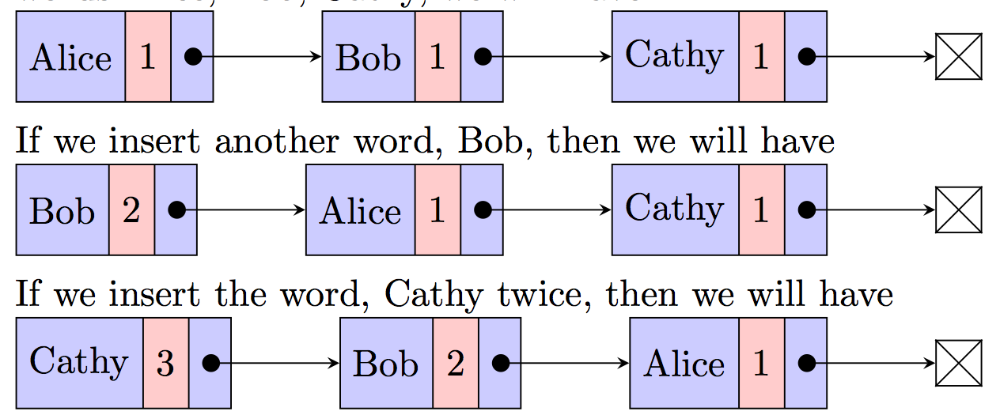

# Project 2: Word Frequency

# Overview
In this assignment, we use a linked list to count the words from a given text file or URL.The link list is maintained in descending order of frequency.
The frequency class contains a private Node class that has been implemented for your use. You will need to make these nodes comparable. Each node can hold a key (the word), a count (the frequency of the word), and a reference to the next Node in the linked list.

There are only four public methods in the frequency class: insert, getCount, getWords and iterator. The rest are private methods and therefore we cannot test them directly. However, we strongly suggest you implement them to reduce code duplication and make your implementation clearer.

# Objectives
This project will allows practice of linked list insert, remove, and test development.

# Word Insertion
The public insert method of the frequency class will be used to insert a word into the linked list. When a new word is inserted, it adds the word into the list. If the word exists in the list, we simply increment the value of "count" for the word. We want to keep the words in the linked list by their frequency order (in descending order of their count). Therefore, when the frequency of a word has changed, we have to move the word to the correct position in the linked list. If two words have the same frequency, they are sorted alphabetically. For example, if we insert three words Alice, Bob and Cathy, we will have:

When multiple words have the same frequency, they should be arranged in ascending alphabetical order as shown in the above image.

# Code Distribution
* frequency - This package includes a linked list class and a driver. Executing the main method in
the WordFrequency class prints the data contained in the frequency linked list as well as the processing time required to build the linked list.  
* utils - Some utility classes to read input and record processing time. 
* tests - Includes the public tests. 

Also included is a data directory that contains test files as well as their corresponding outputs. For example, "einstein.txt" contains data that will be read and used to build a frequency linked list. The expected return value from calling freq using "einstein.txt" as the input source can be found in the file "pubEinstein.txt".

# Specification
As mentioned above, there are only four public methods in the Frequency class that you are expected to implement (and that we can test). The other classes have been provided and you should not modify them. A correct implementation will require the use of the logic encapsulated by the other private methods specified in the Frequency class. If you find yourself doing the same things multiple times, consider migrating the logic to one of these private methods or creating a private method of your own. You do not have to complete the private methods outlined in the Frequency class. However, implementing them will make your implementation of the public methods easier.

# Testing
* You can use the main method to interactively test the code. Simply set the input source to the appropriate file i.e "data/<file_name.txt>". Feel free to add source text files to the data directory for more testing. 
* You can also test with URLs. For example, to test with the URL for a website for War and Peace, change the inputSourceName to "https://www.gutenberg.org/files/2600/2600-h/2600-h.htm". When you test with a URL, the html representation of the page is what is being read. Keeping with War and Peace, the result of finding the frequency of the text using the above URL is different from the result of finding the frequency of the text after copying it into a text file and using the text file as the input source.
* Pay attention to the corner cases, where words are inserted at the start of the linked list and at the end of the linked list.
* Create small text files and test your code with them. Test with bigger files such as War and Peace when you feel confident with your program.  
